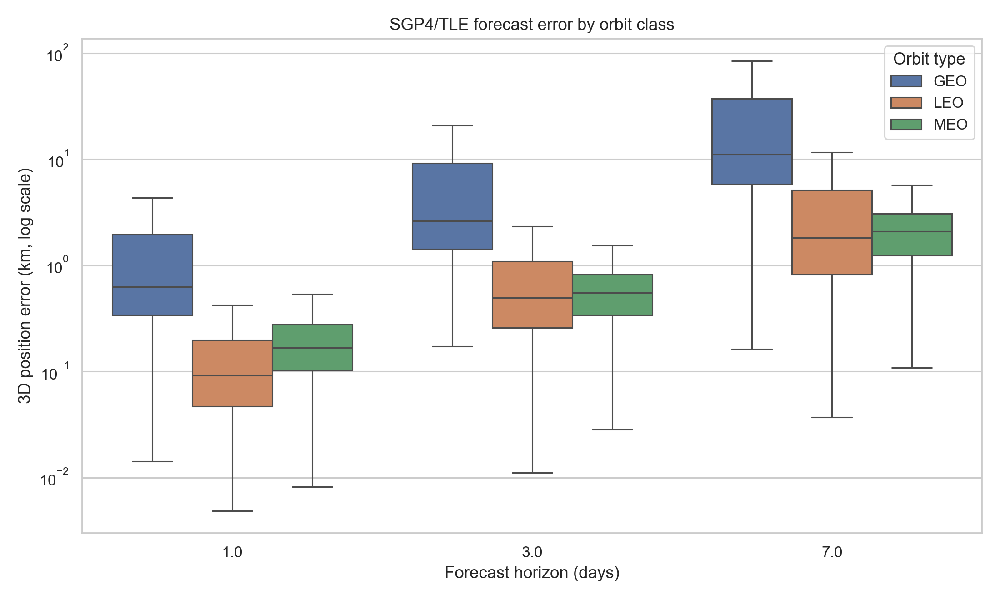
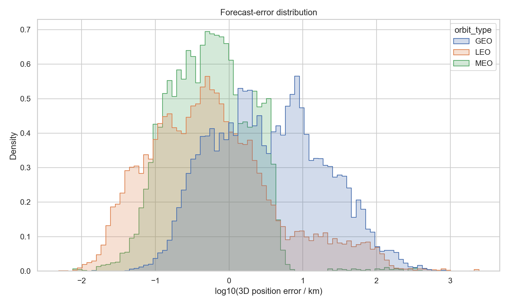
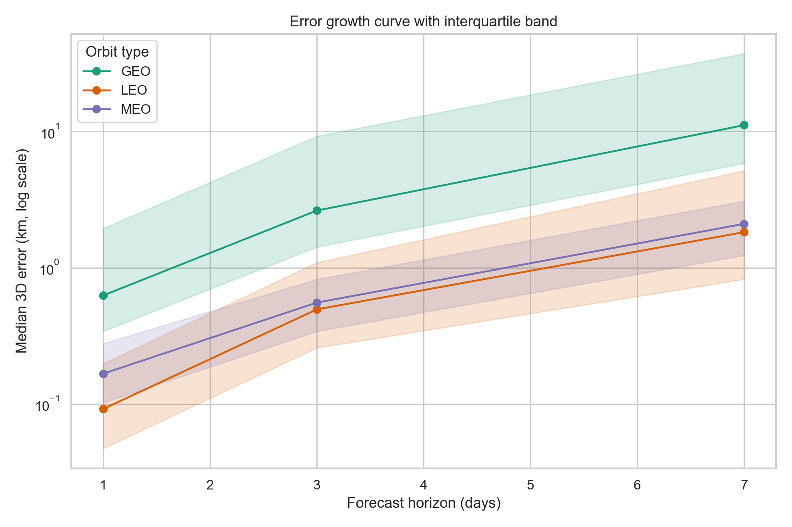
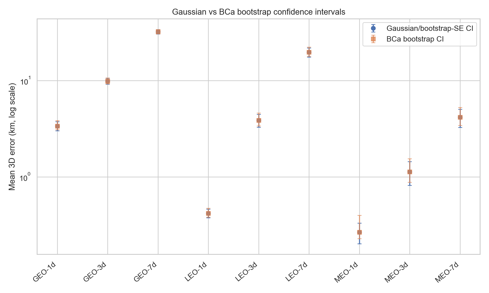

# TLE/SGP4 轨道预报误差的统计分析

作者：  
课程：数理统计  
日期：2026-06-14  

## 摘要

本文基于公开 TLE 编目数据与 SGP4 传播模型，研究空间目标在 1 天、3 天和 7 天预报时长下的位置误差分布及其增长规律。实验选取 LEO、MEO、GEO 三类轨道各 25 个目标，共 75 个 NORAD 目标，使用 Space-Track `gp_history` 下载 2025-01-01 至 2025-03-31 的历史 TLE 数据。经清洗后得到 16214 条 TLE 记录，并形成 43125 条“旧 TLE 预报值 - 新 TLE 参考值”的误差样本。

结果显示，误差随预报时长显著增长，且不同轨道类型差异明显。以三维位置误差中位数计，LEO 在 1/3/7 天后的误差分别为 0.092 km、0.494 km、1.825 km；MEO 分别为 0.167 km、0.555 km、2.100 km；GEO 分别为 0.626 km、2.627 km、11.134 km。误差分布呈现明显右偏和长尾，Bootstrap 区间尤其是 BCa 区间比 Gaussian 区间更能反映非对称不确定性。ANOVA 与 Kruskal-Wallis 检验均表明三类轨道误差分布存在显著差异，其中 GEO 误差整体显著高于 LEO 与 MEO。

## 1. 研究背景

TLE 是目前最广泛使用的公开空间目标轨道根数格式，配合 SGP4 模型可以快速预报卫星位置。然而，TLE 是基于观测数据拟合得到的平均轨道根数，并非高精度动力学轨道。受观测误差、模型误差、大气阻力、轨道机动和定轨策略等因素影响，TLE/SGP4 的预报误差会随时间积累。

本文关注如下统计问题：

1. 预报 1 天、3 天、7 天后，三维位置误差有多大？
2. 误差随预报时间如何增长？
3. LEO、MEO、GEO 三类轨道的误差增长规律是否存在显著差异？
4. Bootstrap 置信区间与 Gaussian 近似置信区间有何差别？

## 2. 数据来源与样本构成

数据来源为 Space-Track 历史 TLE 数据，目标编号文件为 `data/catalog_ids.txt`。该文件由 CelesTrak 当前公开分组辅助生成，包含三类轨道各 25 个目标：

| 轨道类型 | 目标数 | 数据来源示例 |
|---|---:|---|
| LEO | 25 | 气象与地球观测类目标，如 DMSP、FENGYUN、METOP、SENTINEL |
| MEO | 25 | GPS operational satellites |
| GEO | 25 | GEO 气象与通信/中继类目标 |

历史数据时间范围为 2025-01-01 至 2025-03-31。原始数据文件为：

- `data/raw/spacetrack/spacetrack_gp_history_2025-01-01_2025-03-31_chunk001.json`
- `data/raw/spacetrack/spacetrack_gp_history_2025-01-01_2025-03-31_chunk002.json`

解析后得到：

| 数据表 | 记录数 | 说明 |
|---|---:|---|
| `data/interim/tle_records.csv` | 16214 | 标准化后的 TLE 记录 |
| `data/processed/errors.csv` | 43125 | SGP4 预报误差明细 |

误差样本在轨道类型和预报时长上的分布如下：

| 轨道类型 | 1 天 | 3 天 | 7 天 |
|---|---:|---:|---:|
| GEO | 4641 | 4393 | 4188 |
| LEO | 7813 | 7651 | 7291 |
| MEO | 2447 | 2423 | 2278 |

三类轨道在 1/3/7 天三个预报时长下均覆盖 25 个目标。

## 3. 误差计算方法

对同一 NORAD 目标，设较早 TLE 为 \(T_i\)，其历元为 \(t_i\)。对预报时长 \(\Delta t \in \{1,3,7\}\) 天，目标时刻为：

```math
t^\* = t_i + \Delta t
```

将 \(T_i\) 用 SGP4 传播到 \(t^\*\)，得到预报位置：

```math
\mathbf r_{\text{pred}}(t^\*) = \mathrm{SGP4}(T_i, t^\*)
```

选择同一目标在 \(t^\*\) 附近的新 TLE \(T_j\) 作为参考，并传播到同一目标时刻：

```math
\mathbf r_{\text{ref}}(t^\*) = \mathrm{SGP4}(T_j, t^\*)
```

本文允许参考 TLE 的历元与目标时刻相差不超过 12 小时。实际样本中，参考历元偏差的中位数约为 -0.20 至 -0.35 小时，最大绝对偏差不超过 12 小时。

三维位置误差定义为：

```math
E(\Delta t)=\left\|\mathbf r_{\text{pred}}(t^\*)-\mathbf r_{\text{ref}}(t^\*)\right\|_2
```

同时，将误差向量分解到 RIC 坐标系：

- R：径向；
- I：沿迹方向；
- C：轨道面法向。

## 4. 描述统计结果

三维位置误差的主要统计量如下，单位均为 km。

| 轨道类型 | 预报天数 | 样本量 | 均值 | 标准差 | 中位数 | RMSE | 95%分位 | 最大值 |
|---|---:|---:|---:|---:|---:|---:|---:|---:|
| GEO | 1 | 4641 | 3.383 | 12.591 | 0.626 | 13.037 | 15.032 | 472.935 |
| GEO | 3 | 4393 | 9.901 | 23.284 | 2.627 | 25.299 | 36.668 | 454.701 |
| GEO | 7 | 4188 | 32.181 | 54.945 | 11.134 | 63.670 | 130.029 | 828.498 |
| LEO | 1 | 7813 | 0.420 | 1.939 | 0.092 | 1.984 | 1.662 | 77.887 |
| LEO | 3 | 7651 | 3.873 | 26.278 | 0.494 | 26.560 | 14.980 | 907.208 |
| LEO | 7 | 7291 | 19.709 | 91.893 | 1.825 | 93.977 | 86.564 | 2445.275 |
| MEO | 1 | 2447 | 0.268 | 1.662 | 0.167 | 1.683 | 0.584 | 78.137 |
| MEO | 3 | 2423 | 1.133 | 7.957 | 0.555 | 8.035 | 1.335 | 183.164 |
| MEO | 7 | 2278 | 4.162 | 21.697 | 2.100 | 22.088 | 4.397 | 390.463 |

从表中可以看出：

1. 三类轨道的中位数误差均随预报时长单调增大。
2. 均值、标准差、RMSE 明显大于中位数，说明误差分布具有明显右偏和长尾。
3. LEO 的中位数误差较小，但最大误差和 RMSE 很大，说明少数样本可能受到大气阻力、机动、定轨更新或异常 TLE 的强烈影响。
4. GEO 在三个预报时长下的中位数误差均明显高于 LEO 和 MEO。





## 5. 误差增长律拟合

本文分别拟合线性模型与幂律模型。线性模型为：

```math
E(t)=\alpha+\beta t+\varepsilon
```

幂律模型为：

```math
E(t)=a t^b
```

以中位数误差为响应变量，得到如下拟合结果：

| 轨道类型 | 模型 | 拟合表达式 | \(R^2\) |
|---|---|---|---:|
| GEO | linear | \(E(t)=-1.823+1.805t\) | 0.977 |
| GEO | power_law | \(E(t)=0.592t^{1.471}\) | 0.989 |
| LEO | linear | \(E(t)=-0.278+0.295t\) | 0.988 |
| LEO | power_law | \(E(t)=0.092t^{1.536}\) | 1.000 |
| MEO | linear | \(E(t)=-0.275+0.331t\) | 0.980 |
| MEO | power_law | \(E(t)=0.156t^{1.292}\) | 0.982 |

幂律模型在三类轨道上均有较高拟合优度。LEO 的幂指数约为 1.536，GEO 约为 1.471，MEO 约为 1.292。这说明在本文样本和 1 至 7 天时间尺度内，误差增长具有超线性特征，其中 LEO 和 GEO 的中位数误差增长更快。



## 6. Bootstrap 置信区间

对每个“轨道类型 × 预报时长”的误差样本，本文分别估计均值、中位数和 RMSE 的置信区间。Bootstrap 重采样次数为 5000，置信水平为 95%。完整结果见 `outputs/tables/bootstrap_ci.csv`。

### 6.1 中位数误差的 BCa Bootstrap 区间

由于误差分布明显偏态，中位数比均值更能反映典型误差水平。中位数误差及其 BCa 置信区间如下：

| 轨道类型 | 预报天数 | 中位数 | BCa 95% CI |
|---|---:|---:|---:|
| GEO | 1 | 0.626 | [0.605, 0.658] |
| GEO | 3 | 2.627 | [2.518, 2.717] |
| GEO | 7 | 11.134 | [10.680, 11.914] |
| LEO | 1 | 0.092 | [0.089, 0.094] |
| LEO | 3 | 0.494 | [0.483, 0.508] |
| LEO | 7 | 1.825 | [1.773, 1.886] |
| MEO | 1 | 0.167 | [0.160, 0.173] |
| MEO | 3 | 0.555 | [0.538, 0.570] |
| MEO | 7 | 2.100 | [2.040, 2.170] |

### 6.2 均值误差的 BCa Bootstrap 区间

均值误差对极端值更敏感，更能体现长尾风险：

| 轨道类型 | 预报天数 | 均值 | BCa 95% CI |
|---|---:|---:|---:|
| GEO | 1 | 3.383 | [3.098, 3.859] |
| GEO | 3 | 9.901 | [9.304, 10.677] |
| GEO | 7 | 32.181 | [30.583, 33.936] |
| LEO | 1 | 0.420 | [0.384, 0.474] |
| LEO | 3 | 3.873 | [3.392, 4.613] |
| LEO | 7 | 19.709 | [17.903, 22.247] |
| MEO | 1 | 0.268 | [0.229, 0.400] |
| MEO | 3 | 1.133 | [0.883, 1.548] |
| MEO | 7 | 4.162 | [3.433, 5.270] |

Gaussian、Percentile Bootstrap 与 BCa Bootstrap 的对比图如下：



从结果看，均值和 RMSE 的区间比中位数更宽，尤其在 LEO 和 MEO 中更明显。这与误差分布的长尾现象一致。BCa 区间在部分情形下相对于 Gaussian 区间略向右偏移，说明普通正态近似可能低估极端误差对统计量不确定性的影响。

## 7. 协方差传播与经验协方差

误差向量记为：

```math
\mathbf e(t)=\mathbf r_{\text{pred}}(t)-\mathbf r_{\text{ref}}(t)
```

对每个轨道类型和预报时长，估计经验协方差矩阵：

```math
\hat\Sigma(\Delta t)=\operatorname{Cov}[\mathbf e(\Delta t)]
```

协方差传播的理论形式为：

```math
\Sigma(\Delta t)=\Phi(\Delta t)\Sigma_0\Phi(\Delta t)^T+Q(\Delta t)
```

其中 \(\Phi(\Delta t)\) 是状态转移矩阵，\(Q(\Delta t)\) 是过程噪声协方差。本文输出了 TEME 坐标系和 RIC 坐标系下的经验协方差矩阵：

- `outputs/tables/covariance_teme.csv`
- `outputs/tables/covariance_ric.csv`

在没有额外动力学线性化模型时，本文采用 \(\Phi=I\) 作为经验基线，估计过程噪声：

```math
\hat Q(\Delta t)=\hat\Sigma(\Delta t)-\hat\Sigma(\Delta t_0)
```

对应输出为：

- `outputs/tables/process_noise_identity_teme.csv`
- `outputs/tables/process_noise_identity_ric.csv`

该结果可用于展示误差不确定性随预报时长膨胀的矩阵形式。由于 TLE 误差并不一定满足严格线性高斯假设，本文将该协方差结果作为经验描述和与 Bootstrap 方法的对照。

## 8. 轨道类型差异检验

对每个预报时长，分别比较 LEO、MEO、GEO 三类轨道误差分布差异。首先进行单因素 ANOVA，同时考虑到误差分布偏态且方差不齐，使用 Kruskal-Wallis 非参数检验作为主要结论依据。

整体检验结果如下：

| 预报天数 | ANOVA F | ANOVA p值 | Kruskal-Wallis H | Kruskal-Wallis p值 | Levene p值 |
|---:|---:|---:|---:|---:|---:|
| 1 | 277.841 | \(3.40\times 10^{-119}\) | 5539.091 | < \(10^{-300}\) | \(4.13\times 10^{-99}\) |
| 3 | 139.325 | \(1.17\times 10^{-60}\) | 4531.533 | < \(10^{-300}\) | \(1.78\times 10^{-44}\) |
| 7 | 107.944 | \(3.05\times 10^{-47}\) | 3605.725 | < \(10^{-300}\) | \(2.64\times 10^{-33}\) |

Levene 检验在三个时间尺度下均显著，说明方差齐性假设不成立。因此，非参数 Kruskal-Wallis 检验更适合作为主要依据。Kruskal-Wallis 检验在三个时间尺度下均显著，说明不同轨道类型的误差分布存在显著差异。

两两 Mann-Whitney U 检验并经 Holm 校正后，结果如下：

| 预报天数 | 比较 | 中位数 A | 中位数 B | Holm 校正 p值 | 结论 |
|---:|---|---:|---:|---:|---|
| 1 | GEO vs LEO | 0.626 | 0.092 | < \(10^{-300}\) | 显著 |
| 1 | GEO vs MEO | 0.626 | 0.167 | < \(10^{-300}\) | 显著 |
| 1 | LEO vs MEO | 0.092 | 0.167 | \(2.33\times 10^{-116}\) | 显著 |
| 3 | GEO vs LEO | 2.627 | 0.494 | < \(10^{-300}\) | 显著 |
| 3 | GEO vs MEO | 2.627 | 0.555 | < \(10^{-300}\) | 显著 |
| 3 | LEO vs MEO | 0.494 | 0.555 | 0.232 | 不显著 |
| 7 | GEO vs LEO | 11.134 | 1.825 | < \(10^{-300}\) | 显著 |
| 7 | GEO vs MEO | 11.134 | 2.100 | < \(10^{-300}\) | 显著 |
| 7 | LEO vs MEO | 1.825 | 2.100 | 0.306 | 不显著 |

由此可见，GEO 与另外两类轨道在三个预报时长下均存在显著差异，且 GEO 的典型误差更大。LEO 与 MEO 在 1 天误差上存在统计显著差异，但在 3 天和 7 天时差异不显著。

## 9. 讨论

本文结果表明，TLE/SGP4 误差具有以下特点：

1. **误差随时间显著增长。** 三类轨道的中位数误差均从 1 天到 7 天明显增大，且幂律模型拟合效果较好。
2. **误差分布具有长尾。** 均值、标准差和 RMSE 显著大于中位数，说明少量异常样本会显著抬高平均误差。
3. **GEO 典型误差较大。** 在本文样本中，GEO 的 1/3/7 天中位数误差均高于 LEO 和 MEO，且差异统计显著。这可能与 GEO 目标的定点保持、东西漂移、TLE 更新策略和长期相位误差有关。
4. **LEO 有更明显的极端误差。** 虽然 LEO 的中位数误差较小，但 7 天最大误差达到 2445 km，RMSE 也较高。这可能与大气阻力、空间天气、机动、异常 TLE 或参考 TLE 历元偏差有关。
5. **Bootstrap 比 Gaussian 假设更稳健。** 在偏态和长尾误差分布下，BCa Bootstrap 可以给出非对称区间，更适合进行误差量化。

需要说明的是，本文以较新 TLE 的 SGP4 传播位置作为近似参考轨道，而不是使用高精度定轨结果作为真值。因此，本文估计的是“旧 TLE 预报相对于新 TLE 后验轨道”的相对误差。该误差可以有效反映公开 TLE/SGP4 预报精度，但不等同于严格意义上的绝对轨道误差。

此外，同一目标在不同历元上产生多条误差样本，样本之间可能存在相关性。因此，显著性检验结果应主要作为轨道类型差异的统计证据，而非完全独立样本假设下的精确因果结论。

## 10. 结论

本文完成了基于 TLE/SGP4 的空间目标预报误差统计分析，主要结论如下：

1. 在 2025-01-01 至 2025-03-31 的 75 个目标样本中，1/3/7 天预报误差均随时间显著增长。
2. 以中位数误差计，LEO 的 1/3/7 天误差为 0.092 km、0.494 km、1.825 km；MEO 为 0.167 km、0.555 km、2.100 km；GEO 为 0.626 km、2.627 km、11.134 km。
3. 幂律增长模型 \(E(t)=at^b\) 能较好描述误差增长，其中 LEO 和 GEO 的增长指数约为 1.5，MEO 约为 1.3。
4. 误差分布具有明显偏态和长尾，因此中位数和 Bootstrap 置信区间比单纯均值和 Gaussian 近似更稳健。
5. Kruskal-Wallis 检验显示三类轨道误差分布存在显著差异，GEO 相对于 LEO 和 MEO 的典型误差显著更大。

## 参考资料

1. CelesTrak GP Data: https://celestrak.org/NORAD/elements/
2. CelesTrak GP query documentation: https://celestrak.org/NORAD/documentation/gp-data-formats.php
3. Space-Track: https://www.space-track.org/
4. Vallado et al., Revisiting Spacetrack Report #3.
5. Python `sgp4` package documentation.

## 附录：输出文件

主要结果文件如下：

- `outputs/tables/summary.csv`
- `outputs/tables/bootstrap_ci.csv`
- `outputs/tables/growth_fit.csv`
- `outputs/tables/group_tests.csv`
- `outputs/tables/pairwise_mannwhitney_holm.csv`
- `outputs/tables/covariance_ric.csv`
- `outputs/tables/covariance_teme.csv`
- `outputs/figures/error_boxplot_by_orbit_horizon.png`
- `outputs/figures/error_growth_median_iqr.png`
- `outputs/figures/error_distribution_log10.png`
- `outputs/figures/ci_gaussian_vs_bootstrap.png`
